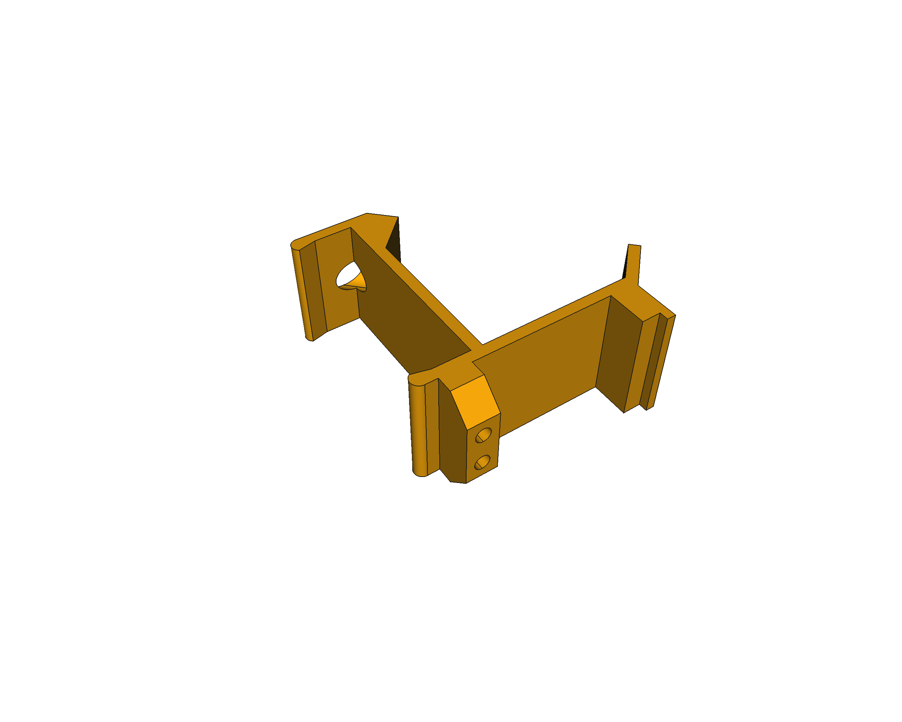

# Escornabot COVID19 - 3D models

Updated models of the Escornabot Brivoi-DIY version to the last version of [FreeCAD](https://freecadweb.org) (v0.19), using exclusively the **Part-Design workbench** and including some minor changes to suit my own personal needs and issues (that may be useful for others too).

### Battery bracket

### Motor bracket

### Ball caster

### Keypad holder

### Switch holder

### Board bracket

### Wheels

## LICENSE

This work is licensed under the [GNU General Public License v3.0](LICENSE-GPLV30). All media and data files that are not source code are licensed under the [Creative Commons Attribution 4.0 BY-SA license](LICENSE-CCBYSA40).

More information about licenses in [Opensource licenses](https://opensource.org/licenses/) and [Creative Commons licenses](https://creativecommons.org/licenses/).
