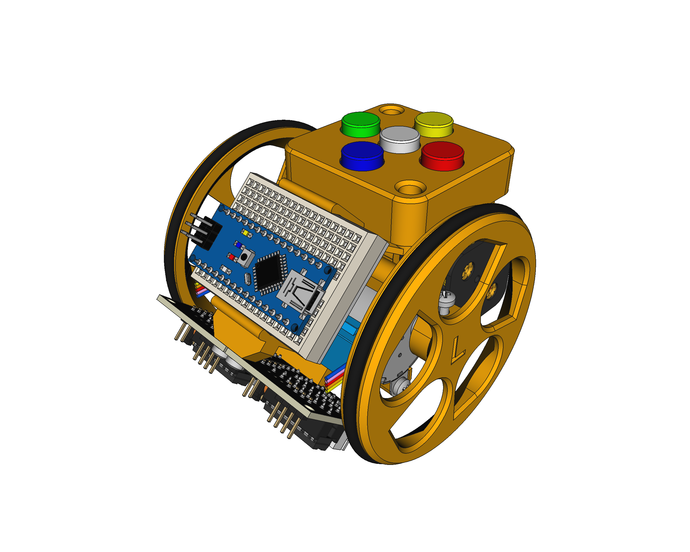
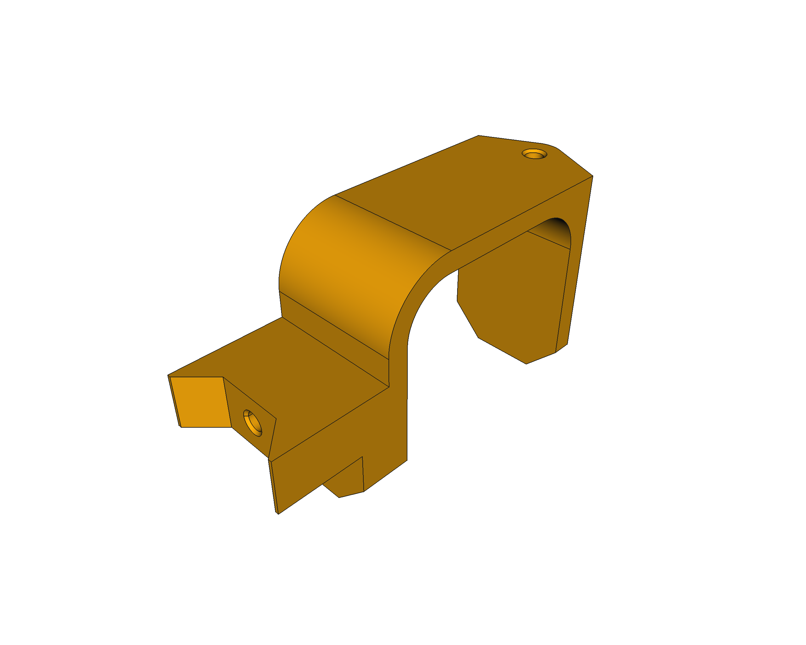
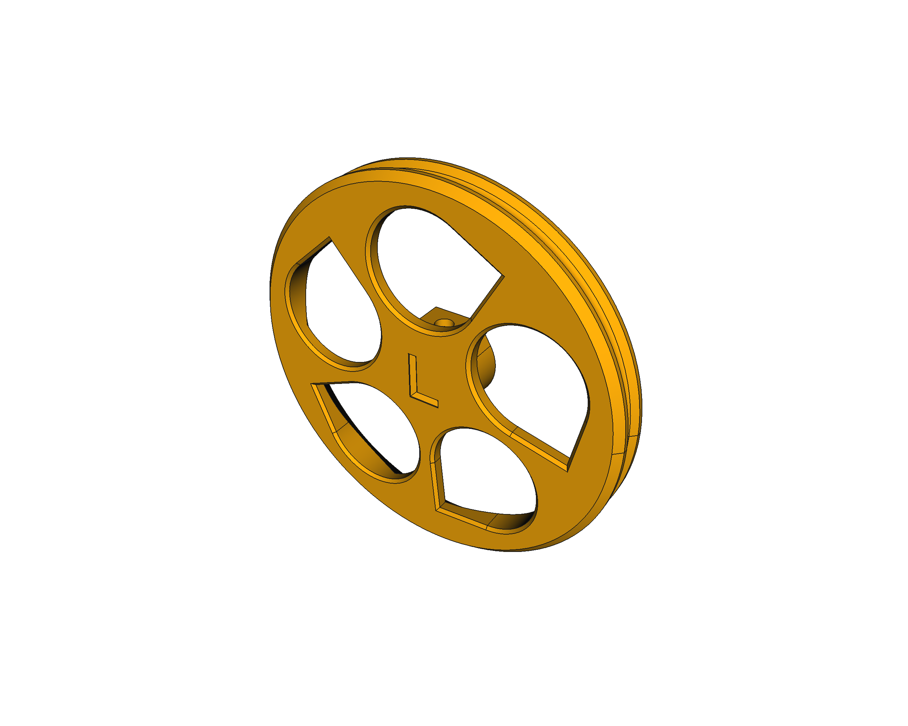

# Escornabot COVID19 - 3D models

Updated models of the **Escornabot Brivoi-DIY** version to the last version of [FreeCAD](https://freecadweb.org) (v0.19), using exclusively the **Part-Design workbench** and including some minor changes to suit my own personal needs and issues (that may be useful for others too).

### Battery bracket
Added configuration params to better fit the dimesions of the battery holder.

### Motor bracket
Changed the connection joint to the battery bracket: easier, simpler and more robust.

### Ball caster
Just converted to Part-Design workbench.

### Keypad holder
Added estructural support for the screw holders: easier to print and more robust.

### Switch holder
Converted to Part-Design workbench.

### Board bracket
Converted to Part-Design workbench and updated supports for the stepper driver boards that should not move now.

### Wheels
Circular bed for the o-ring (no more "v"). Updated "L" and "R" letters and dimensions of some of the holes. Part-Design only.

### Keypad cover
This one is new, for my own Ki-CAD keyboard with BF13 buttons and caps.

## LICENSE

This work is licensed under the [GNU General Public License v3.0](../LICENSE-GPLV30). All media and data files that are not source code are licensed under the [Creative Commons Attribution 4.0 BY-SA license](../LICENSE-CCBYSA40).

More information about licenses in [Opensource licenses](https://opensource.org/licenses/) and [Creative Commons licenses](https://creativecommons.org/licenses/).
