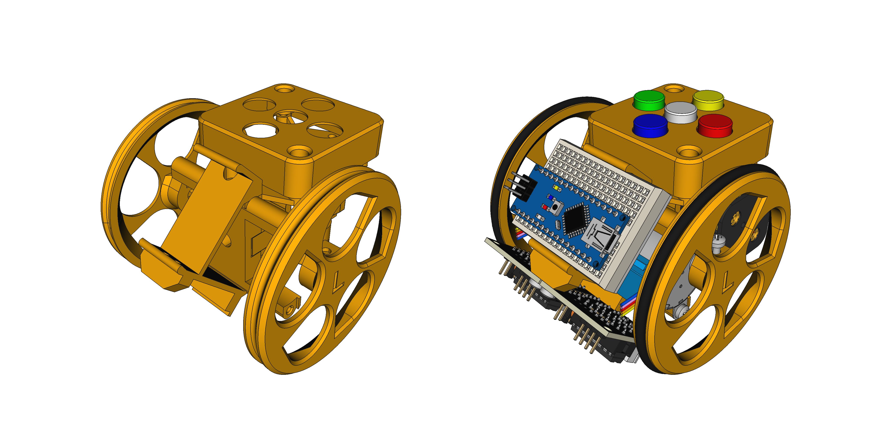
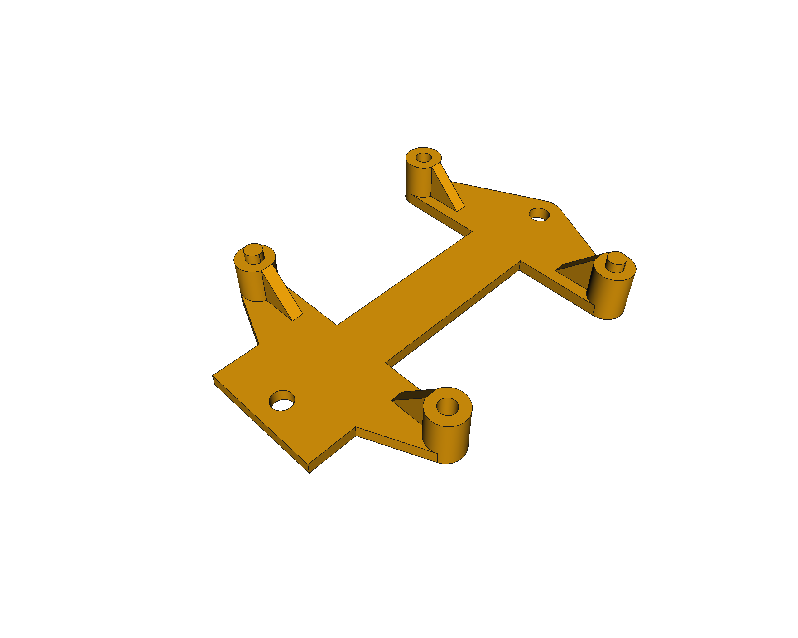
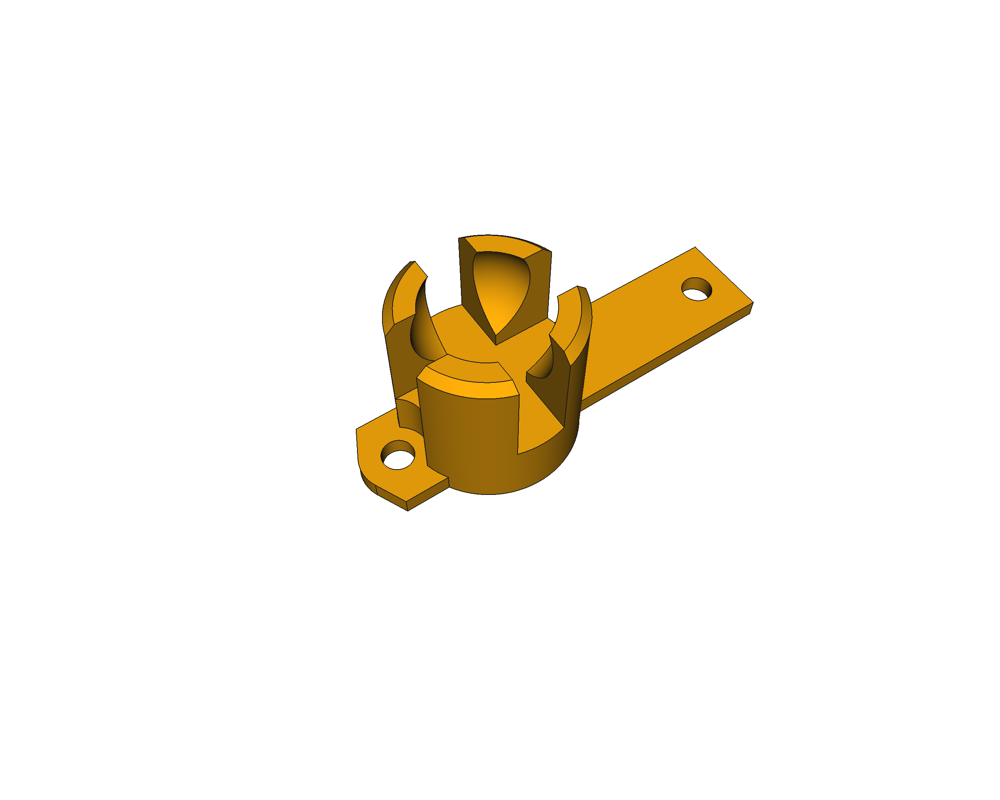
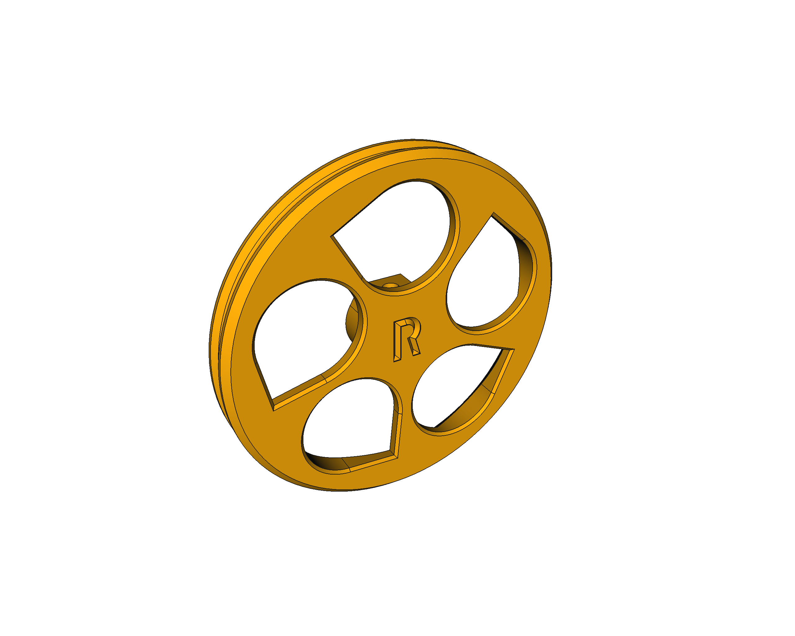

# Escornabot COVID19 - 3D models

Updated 3D models of the **Escornabot Brivoi-DIY** to the last version of [FreeCAD](https://freecadweb.org) (v0.19), using exclusively the **Part-Design workbench** and including some minor changes to suit my own personal needs and issues (explained below), that may be useful to others too.

* Now with a full assembly file (for the [Assembly4 FreeCAD workbench](https://wiki.freecadweb.org/Assembly4_Workbench)): **[escornabot.FCStd](escornabot.FCStd)**
* Additional non printable 3D parts in the `parts` folder
* STL files already generated and ready to use

### Battery bracket
New v-shaped joint for the motor bracket (borrowed from [Xoan](https://github.com/xoan?tab=repositories&q=escornabot)). Added configuration params to better fit different battery holder dimensions as I've found important differences.

### Motor bracket
Updated connection joint to the battery bracket: easier, simpler and more robust. Additional support for the stepper motor tabs.

### Keypad holder
Thinner. Added estructural support for the screw holders: easier to print and more robust.

### Board bracket
Converted to Part-Design workbench and updated supports for the stepper driver boards that should not move now.

### Ball caster
Added configuration params (e.g. ball diameter) and converted to Part-Design workbench.

### Switch holder
Converted to Part-Design workbench and redesigned.

### Wheels
Circular bed for the o-ring (no more "v"). Updated "L" and "R" letters and dimensions of some of the holes. Converted to Part-Design only. Available [base wheel](wheel-base.FCStd) ready to be customized.

### Keypad cover
This one is new, for [my own Ki-CAD keyboard](https://github.com/mgesteiro/escornakeypad) with B3F-40xx buttons and caps. Round corners, finally!

## Extras
I made a couple of extra models:

### Escornaface
A piece to customize your Escornabot: put your name (or whatever you want).

### Ogaki CPU holder
In case you have an Abierto's Ogaki Escornabot: use instead of the **keypad holder** and **board bracket**.

## LICENSE

This work is licensed under the [GNU General Public License v3.0](../LICENSE-GPLV30). All media and data files that are not source code are licensed under the [Creative Commons Attribution 4.0 BY-SA license](../LICENSE-CCBYSA40).

More information about licenses in [Opensource licenses](https://opensource.org/licenses/) and [Creative Commons licenses](https://creativecommons.org/licenses/).
