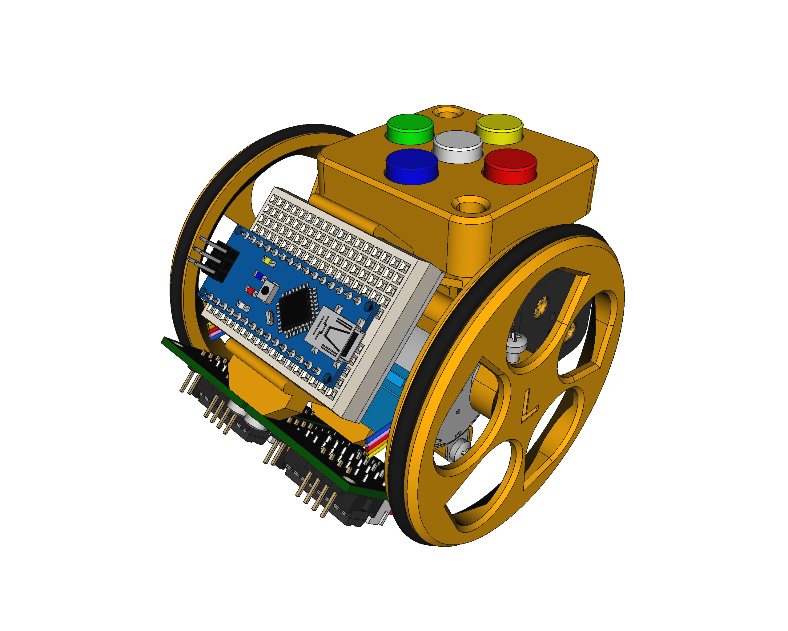
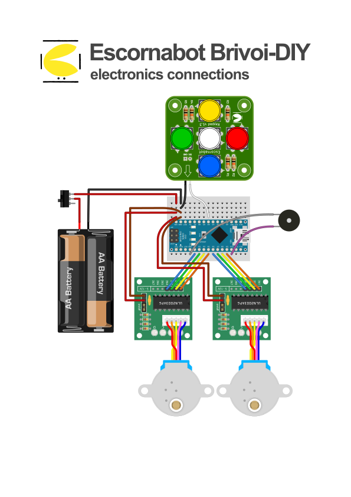
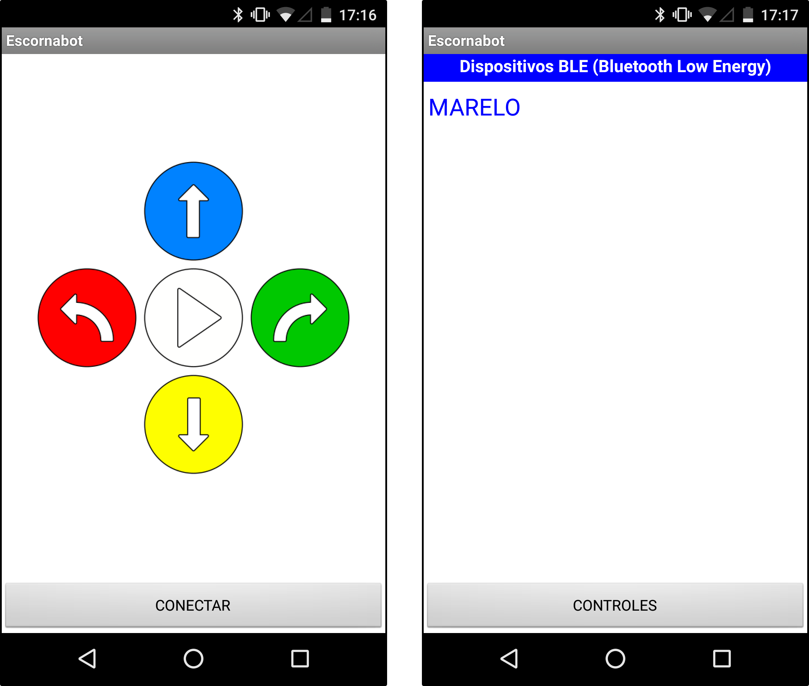

# Escornabot Brivoi Audacius (DIY)
My own update to some parts of the [Escornabot project](https://github.com/escornabot) started during the COVID-19 lockdown.

* **[3D](3D/):** Inspired in the genius work and lessons from [Xoan](https://github.com/xoan?tab=repositories&q=escornabot), I updated the **Brivoi Audacius (or DIY)** models to the last version of [FreeCAD](https://freecadweb.org) (v0.19), using exclusively the **Part-Design workbench** and including some minor changes to suit my own personal needs and issues (that may be useful for others too).

    

* **Electronics:** Everything related to the electronic part of the robot
    * **[Connections](electronics/connections/):** main schematic (done with [Fritzing](https://fritzing.org)).
    * **[Bluetooth Lower Energy](electronics/bluetooth/):** schematic, control App and firmware.

    
    

## LICENSE

This work is licensed under the [GNU General Public License v3.0](LICENSE-GPLV30). All media and data files that are not source code are licensed under the [Creative Commons Attribution 4.0 BY-SA license](LICENSE-CCBYSA40).

More information about licenses in [Opensource licenses](https://opensource.org/licenses/) and [Creative Commons licenses](https://creativecommons.org/licenses/).
