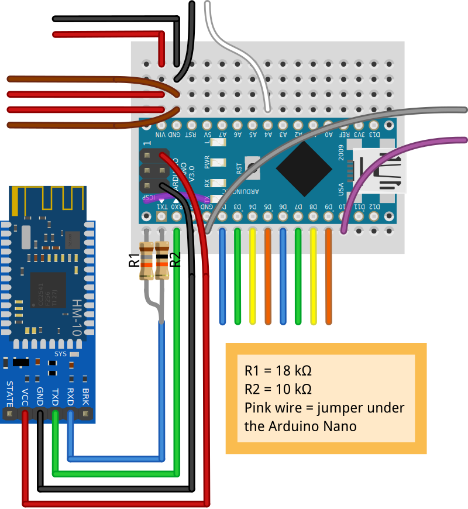

# Escornabot Brivoi-DIY - Bluetooth Low Energy (BLE)
Providing **Bluetooth Low Energy** connectivity to the **Escornabot Brivoi-DIY** using an [**HM-10 BLE dongle**](https://www.aliexpress.com/wholesale?SearchText=HM-10+arduino).

## CONNECTIONS / SCHEMATIC
These are the six additional connections required for the [main basic schematic](../connections/) (done with [Fritzing](https://fritzing.org)):

* **R1** and **R2** resistors conform a voltage divider to adapt Arduino's 5V TX ttl output levels to those 3.3V of the **HM-10 BLE dongle**.
* The pink wire/jumper is **under the Arduino Nano**, to extend the GND connection to the first low column of the protobard, where the **R1** resistor is connected.

## ENABLING Bluetooth
If you want to use *Bluetooth connectivity* in your **Escornabot**, please make sure that **it is ENABLED** in its firmware: before [compiling and uploading it](https://www.roboteach.es/escornabot-firmware/) edit the `Config.h` file and make sure that this line is enabled (=`true`) like this:

`#define USE_BLUETOOTH true`

## CONTROL APP
Once you have the dongle installed in your **Escornabot** and the *Bluetooth connectivity* enabled, you need *something* to send commands to it. This is usually an *App* that you can install in your smartphone or tablet.

If you have an **Android system** (smartphone/tablet) you can use our own open-source [**Escornabot app APK**](control-app/Escornabot.apk) (more info available in the [`control-app`](control-app/) folder).

For **iOS systems** you can use the [Escornabot BLE app](https://apps.apple.com/es/app/escornabot-ble/id1444892609), that is also open-source and available on [Ismael Serrano's github](https://github.com/ismaserrano/EscornaBotMobile).

Finally, if you like to tinker yourself, you can use **any BLE App, Escanner or tool** that allows you to connect and send characters to the dongle: you should send any of the `[n, w, g, e, s, N, W, G, E, S]` characters followed by a line feed (`LF` or `\n`) as commands (**n**orth, **s**outh, **e**ast, **w**est and **g**o).

## LICENSE

This work is licensed under the [GNU General Public License v3.0](../LICENSE-GPLV30). All media and data files that are not source code are licensed under the [Creative Commons Attribution 4.0 BY-SA license](../LICENSE-CCBYSA40).

More information about licenses in [Opensource licenses](https://opensource.org/licenses/) and [Creative Commons licenses](https://creativecommons.org/licenses/).
