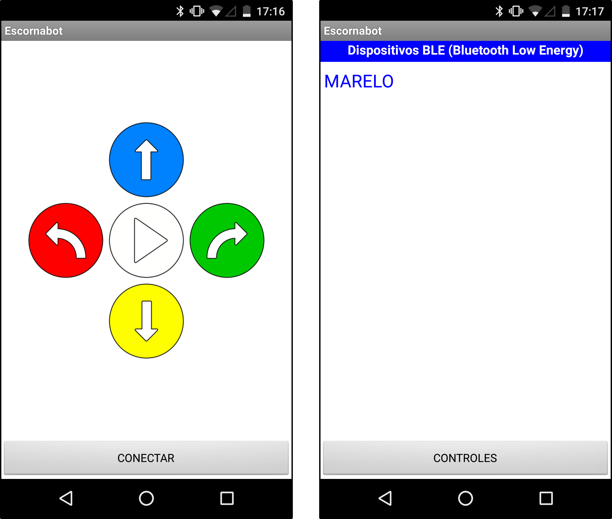
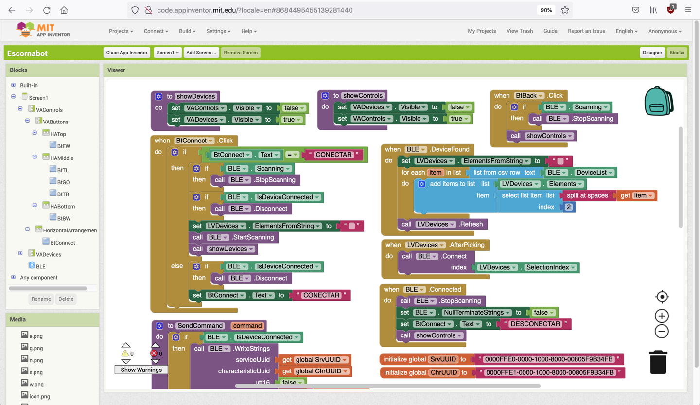

# Escornabot Brivoi-DIY - Bluetooth Low Energy (BLE) Android control App

This is an open-source **Bluetooth Low Energy control App** for the **Escornabot Brivoi-DIY** using an [**HM-10 BLE dongle**](https://www.aliexpress.com/wholesale?SearchText=HM-10+arduino) that you can [connect to the **Escornabot**](..) itself.

As it's **open-source** it's public, available and free to use:

  * The **Escornabot** app compiled APK ready to install: [Escornabot.apk](Escornabot.apk)
  * The **Escornabot** app *AppInventor* source code: [Escornabot.aia](Escornabot.aia)

This app has been developed and generated using the [MIT App Inventor system](http://appinventor.mit.edu/), a platform that enables you to create *Android mobile Apps* using its **Graphical Designer and Visual Blocks language IDE**.

For **iOS systems** you can use the [Escornabot BLE App](https://apps.apple.com/es/app/escornabot-ble/id1444892609), that is also open-source and available on [Ismael Serrano's github](https://github.com/ismaserrano/EscornaBotMobile).

Finally, if you like to tinker yourself, you can use **any BLE App, Escanner or tool** that allows you to connect and send characters to the dongle: you should send any of the `[n, w, g, e, s, N, W, G, E, S]` characters followed by a line feed (`LF` or `\n`) as commands (**n**orth, **s**outh, **e**ast, **w**est and **g**o).

## LICENSE

This work is licensed under the [GNU General Public License v3.0](../LICENSE-GPLV30). All media and data files that are not source code are licensed under the [Creative Commons Attribution 4.0 BY-SA license](../LICENSE-CCBYSA40).

More information about licenses in [Opensource licenses](https://opensource.org/licenses/) and [Creative Commons licenses](https://creativecommons.org/licenses/).
