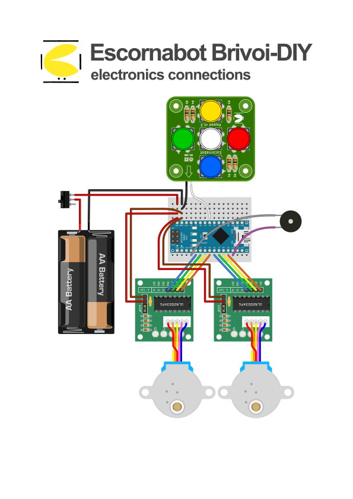

# Escornabot Brivoi-DIY - connections

Main electronics connection schematic for the **Escornabot Brivoi-DIY**, done with [Fritzing](https://fritzing.org).

It uses some Fritzing parts available [here](https://github.com/mgesteiro/fritzing-parts). This assembly is based on my analog keypad, that is published [here](https://github.com/mgesteiro/escornakeypad).

## LICENSE

This work is licensed under the [GNU General Public License v3.0](../LICENSE-GPLV30). All media and data files that are not source code are licensed under the [Creative Commons Attribution 4.0 BY-SA license](../LICENSE-CCBYSA40).

More information about licenses in [Opensource licenses](https://opensource.org/licenses/) and [Creative Commons licenses](https://creativecommons.org/licenses/).
